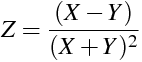

# LOAD LIBRARIES
```{r message=FALSE}
library(dplyr)    # %>%;    citation("dplyr")
library(plyr)     # ddply;  citation("plyr") # must be loaded after dplyr

library(reshape2) # melt(); citation("reshape2")

library(pander)   # pandoc.table

library(rlang)


```

# DEFINE FUNCTIONS
## Standard error
The `se()` function is used to calculate the `standard error` of the mean. `x` represents a numeric vector containing replicates of a given measurement. The `na.rm = TRUE` argument indicates that by default this function ignores missing values.
```{r echo=TRUE}
# x:  numeric

se <- function(x, ...) {
  sd(x, ...) / sqrt(length(x))
}
```

```{r echo=TRUE, results='markup'}
se(c(0.647603, 0.547048, 0.529873, NA, 0.908040, 0.835195))
```

```{r echo=TRUE, results='markup'}
se(c(0.647603, 0.547048, 0.529873, NA, 0.908040, 0.835195), na.rm = TRUE)
```

## Gaussian error propagation
The following function is based on article published on January 22, 2015 by Lee Pang in the R bloggers website (https://www.r-bloggers.com/easy-error-propagation-in-r/). It allows convenient integration with libraries of the tidyverse and the dplyr grammar. It builds on the mutate() function to apply the chain rule on any given mathematical formula.

To illustrate its working let's assume one needs to propagate the error on the following $Z$ calculation:

<!-- $$ -->
<!-- Z = \frac{(X-Y)}{(X+Y)^2} -->
<!-- $$ -->
<center style="margin-bottom: 25px;">

</center>
  
  
The Gaussian propagated error $dZ$ can be calculated by applying the chain-rule to $Z$, as follows:

<!-- $$ -->
<!-- dZ = \sqrt{ -->
<!--   \left\{ dX*\left[         \frac{1}{(X + Y)^2} - (X - Y) * \frac{2 * (X + Y)}{\left[(X + Y)^2 \right]^2} \right]         \right\}^2 + -->
<!--   \left\{ dY*\left[ -\left( \frac{1}{(X + Y)^2} + (X - Y) * \frac{2 * (X + Y)}{\left[(X + Y)^2 \right]^2} \right) \right] \right\}^2 -->
<!-- } -->
<!-- $$ -->
<center style="margin-bottom: 25px;">

</center>

The `mutate_with_error()` receives any given formula, construct the respective formula for error propagation and returns the results of both calculations. For this two arguments must be input to the `mutate_with_error()` function. First, the `.data` argument receives a `data.frame` containing the mean values to be used in the calculation (i.e. $X$ and $Y$ in the example above) plus the standard error of these means (i.e. $dX$ and $dY$) as individual columns. This nomenclature is important: all columns containing standard errors must be named with $d$ appended to its respective mean values column. Then `f` receives a `formula` object indicating the calculation to be done. _Vide_ below for more details on the structure of the datasets.

Inside the `mutate_with_error()` function we have the `exprs` object which is a list of the two calculations to be done - the value of interest and the propagated error. First, the `deparse(f[[3]])` command transform the right-hand side of the formula `f` into a `character` string. Then, a new `character` string is constructed containing the full right-hand side of the formula that will be used to calculated the propagated error (_vide_ below). Finally, the left-hand side of the new error propagation formula is created by appending the character $d$ to the original formula left-hand side (i.e. $Z$ becomes $dZ$). The `mutate_with_error()` run these commands and return the results of the calculation defined by the formula and its associated propagated error appended to `.data`.

```{r}
# .data: data.frame
#     f: formula
mutate_with_error = function(.data, f) {
  require(dplyr)
  
  exprs = list(
    # expression to compute new variable values
    deparse(f[[3]]),
    
    # expression to compute new variable errors
    sapply(all.vars(f[[3]]), function(v) {
      dfdp = deparse(D(f[[3]], v))
      sprintf('(d%s*(%s))^2', v, dfdp)
    }) %>%
      paste(collapse='+') %>%
      sprintf('sqrt(%s)', .)
  )
  
  names(exprs) = c(
    deparse(f[[2]]),                 # unchanged names
    sprintf('d%s', deparse(f[[2]]))  # 'd' appended to the names
  )
  
  # MATHEMAGICS!
  .data[names(exprs)] <- lapply(exprs , function(x) { eval(parse(text= x), envir = .data) })
  #.data %>% mutate_(.dots=exprs) #### -> mutate_() is deprecated, figure out how to fix.
  
  .data
}
```

```{r echo=TRUE, results='asis'}
data.frame(X = c(0.647, 0.547, 0.529, 0.908, 0.835), Y = c(1.072, 0.905, 0.877, 1.503, 1.383)) %>%
  summarise(dX = se(X), dY = se(Y), X = mean(X), Y = mean(Y)) %>%
  mutate_with_error(Z ~ (X-Y)/(X+Y)^2) %>%
  select(X, dX, Y, dY, Z, dZ) %>%
  pandoc.table(style = "rmarkdown")
```


# LOAD DATA
The sections below demonstrates the procedure for calculating $K_s$, $K_d$ and $RGR^{STR}$ using data from Ishihara et al., 2017.

Datasets from the original publication are available online at [LINK]. Datasets are expected to contain replicate measurements as rows, metadata information and measurement values as columns. Data from Ishihara et al., 2017 is composed by replicate measurements from three independent experiments (`Exp`) done in various genotypes (`Genotype`) at different time points (`time`). It contains measurements of 13C labelling alanine and serine enrichments in proteins (`Prot_Ala` and `Prot_Ser`) and in free amino acids (`Free_Ala` and `Free_Ser`) plus glucose enrichment in cell walls (`Glc`). [NEED TO CHECK THE TEXT ITSELF, PHRASE BETTER]

* All missing values should be set as `NA` in your original table
* `CSV` files are a convenient way of loading data to R.

```{r}
ishihara2017_data <- read.csv2("data/KDKSRGR_13C.enrichment[3].csv")

# check data structure
str(ishihara2017_data)
```

# PREPARE DATA
There are many different ways in which R can prepare datasets. Nevertheless, the important bits are: the data must be summarised - i.e. the mean and standard error of the mean should be used below which must be placed in individual columns with names as indicated above.

```{r echo=TRUE, results='asis'}
vars_prot <- c("Prot_Ala", "Prot_Ser")
vars_free <- c("Free_Ala", "Free_Ser")
vars_glc  <- c("Glc")
vars_id   <- c("Genotype", "time")

ishihara2017_summary <- ishihara2017_data %>%
  #ddply(.(Genotype, time), function(each.data) {
  ddply(as.quoted(vars_id), function(each.data) {
    ldply(c(vars_prot, vars_free, vars_glc), function(each_var) {
      rbind(
        data.frame(variable = each_var,              value = mean(each.data[,each_var], na.rm = T)),
        data.frame(variable = paste0("d", each_var), value =   se(each.data[,each_var], na.rm = T))
      )
    })
  }) %>%
  #dcast(Genotype + time ~ variable)
  dcast(paste(paste(vars_id, collapse = " + "), "variable", sep = " ~ "))

ishihara2017_summary %>%
  head() %>%
  pandoc.table(style = "rmarkdown")
```

Cases in which calculations involve comparisons between time points demands reorganization of the data set we are using. Below we define a logic to create a individual column for values of each time point. This will be achieved by melting the original data set, renaming the variable names (i.e. append the time to their names) and finally re-casting the tidy data set into a wide data set; as follows:

```{r echo=TRUE, results='asis'}
ishihara_pulse_data <- ishihara2017_summary %>%
  subset(time %in% c(0, 24)) %>%
  melt(id.vars = vars_id) %>%
  mutate(variable = paste(variable, time, sep = "_")) %>%
  select(-time) %>%           # remove unwanted columns
  dcast(Genotype ~ variable)

ishihara_pulse_data %>%
  head() %>%
  pandoc.table(style = "rmarkdown")
```


# PULSE EXPERIMENTS
## Estimation of KS
We calculate the average enrichment of free labelled alanine and serine at ZT24 and then the $K_S$ - using Gaussian error propagation (REF).

```{r echo=TRUE, results='asis'}
ishihara_KS <- ishihara_pulse_data %>%
  mutate_with_error( KS_Ala ~ (Prot_Ala_24 - Prot_Ala_0) / Free_Ala_24 ) %>% # calculate KS for Alanine
  mutate_with_error( KS_Ser ~ (Prot_Ser_24 - Prot_Ser_0) / Free_Ser_24 ) %>% # calculate KS for Serine
  select(c("Genotype", "KS_Ala", "dKS_Ala", "KS_Ser", "dKS_Ser"))

ishihara_KS %>%
  pandoc.table(style = "rmarkdown")
```

## Estimation of RGRSTR
```{r echo=TRUE, results='asis'}
ishihara_RGRp <- ishihara_pulse_data %>%
  mutate_with_error( RGRp ~ Glc_24 - Glc_0 ) %>%
  select(c("Genotype", "RGRp", "dRGRp"))

ishihara_RGRp %>%
  pandoc.table(style = "rmarkdown")
```

## Estimation of KD
Calculation of $K_{d_p}$ can then be easily achieved by joining the previously calculated datasets containing $K_s$ and $RGR^{STR}_p$ results and apply the $K_{d_p}$ formula.

```{r echo=TRUE, results='asis'}
ishihara_KDp <- join(ishihara_KS, ishihara_RGRp, by = "Genotype") %>%
  mutate_with_error( KDp_Ala ~ KS_Ala - RGRp ) %>%
  mutate_with_error( KDp_Ser ~ KS_Ser - RGRp ) %>%
  select(c("Genotype", "KDp_Ala", "dKDp_Ala", "KDp_Ser", "dKDp_Ser"))

ishihara_KDp %>%
  pandoc.table(style = "rmarkdown")
```


# CHASE EXPERIMENTS
```{r echo=TRUE, results='asis'}
ishihara_chase_data <- ishihara2017_summary %>%
  subset(time %in% c(24, 120)) %>%
  melt(id.vars = vars_id) %>%
  mutate(variable = paste(variable, time, sep = "_")) %>%
  select(-time) %>%           # remove unwanted columns
  dcast(Genotype ~ variable)

ishihara_chase_data %>%
  pandoc.table(style = "rmarkdown")
```

## Estimation of KS
Note that results are in #/day :$(120h - 24h) \div 24h/day = 4 days$; This value has to be input as 'numeric' and not as an object given the behaviour of `mutate_with_error()`.
(This can be solved dynamically, to implement in the future.)

```{r echo=TRUE, results='asis'}
ishihara_KSloss <- ishihara_chase_data %>%
  mutate_with_error( KSloss_Ala ~ -((log(Prot_Ala_120) - log(Prot_Ala_24))) / (4) ) %>%
  mutate_with_error( KSloss_Ser ~ -((log(Prot_Ser_120) - log(Prot_Ser_24))) / (4) ) %>%
  select(c("Genotype", "KSloss_Ala", "dKSloss_Ala", "KSloss_Ser", "dKSloss_Ser"))

ishihara_KSloss %>%
  pandoc.table(style = "rmarkdown")
```

## Estimation of RGRSTR
Similarly to what was done for the pulse data, the $RGR^{STR}_c$ calculation also demands re-organization of the original dataset.

Note that results are in #/day :$(120h - 24h) \div 24h/day = 4 days$; This value has to be input as 'numeric' and not as an object given the behaviour of `mutate_with_error()`.

```{r echo=TRUE, results='asis'}
ishihara_RGRc <- ishihara_chase_data %>%
  mutate_with_error( RGRc ~ 1 - (Glc_120 / Glc_24)^(1/4) ) %>% 
  select(c("Genotype", "RGRc", "dRGRc"))

ishihara_RGRc %>%
  pandoc.table(style = "rmarkdown")
```

## Estimation of KD
```{r echo=TRUE, results='asis'}
ishihara_KDc <- join(ishihara_KSloss, ishihara_RGRc, by = "Genotype") %>%
  mutate_with_error( KDc_Ala ~ KSloss_Ala - RGRc ) %>%
  mutate_with_error( KDc_Ser ~ KSloss_Ser - RGRc ) %>%
  select(c("Genotype", "KDc_Ala", "dKDc_Ala", "KDc_Ser", "dKDc_Ser"))

ishihara_KDc %>%
  pandoc.table(style = "rmarkdown")
```