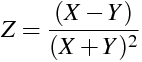
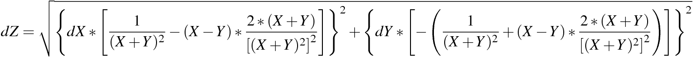

# LOAD LIBRARIES

``` r
library(dplyr)    # %>%;    citation("dplyr")
library(plyr)     # ddply;  citation("plyr") # must be loaded after dplyr

library(reshape2) # melt(); citation("reshape2")

library(pander)   # pandoc.table

library(rlang)
```

# DEFINE FUNCTIONS

## Standard error

The `se()` function is used to calculate the `standard error` of the
mean. `x` represents a numeric vector containing replicates of a given
measurement. The `na.rm = TRUE` argument indicates that by default this
function ignores missing values.

``` r
se <- function(x, ...) {
  # x:  numeric
  sd(x, ...) / sqrt(length(x))
}
```

``` r
se(c(0.647603, 0.547048, 0.529873, NA, 0.908040, 0.835195))
```

    ## [1] NA

``` r
se(c(0.647603, 0.547048, 0.529873, NA, 0.908040, 0.835195), na.rm = TRUE)
```

    ## [1] 0.06965193

## Gaussian error propagation

The following function is based on article published on January 22, 2015
by Lee Pang in the R bloggers website
(<https://www.r-bloggers.com/easy-error-propagation-in-r/>). It allows
convenient integration with libraries of the tidyverse and the dplyr
grammar. It builds on the `mutate()` function to apply the chain rule on
any given mathematical formula.

To illustrate its working let's assume one needs to propagate the error
on the following __*Z*__ calculation:

<!-- $$ -->
<!-- Z = \frac{(X-Y)}{(X+Y)^2} -->
<!-- $$ -->
<center style="margin-bottom: 25px;">

</center>

The Gaussian propagated error __*dZ*__ can be calculated by applying the
chain-rule to __*Z*__, as follows:

<!-- $$ -->
<!-- dZ = \sqrt{ -->
<!--   \left\{ dX*\left[         \frac{1}{(X + Y)^2} - (X - Y) * \frac{2 * (X + Y)}{\left[(X + Y)^2 \right]^2} \right]         \right\}^2 + -->
<!--   \left\{ dY*\left[ -\left( \frac{1}{(X + Y)^2} + (X - Y) * \frac{2 * (X + Y)}{\left[(X + Y)^2 \right]^2} \right) \right] \right\}^2 -->
<!-- } -->
<!-- $$ -->
<center style="margin-bottom: 25px;">

</center>

The `mutate_with_error()` receives any given formula, construct the
respective formula for error propagation and returns the results of both
calculations. For this two arguments must be input to the
`mutate_with_error()` function. First, the `.data` argument receives a
`data.frame` containing the mean values to be used in the calculation
(i.e. __*X*__ and __*Y*__ in the example above) plus the standard error of these
means (i.e. __*dX*__ and __*dY*__) as individual columns. This nomenclature
is important: all columns containing standard errors must be named with
__d__ appended to its respective mean values column. Then `f` receives a
`formula` object indicating the calculation to be done. *Vide* below for
more details on the structure of the datasets.

Inside the `mutate_with_error()` function we have the `exprs` object
which is a list of the two calculations to be done - the value of
interest and the propagated error. First, the `deparse(f[[3]])` command
transform the right-hand side of the formula `f` into a `character`
string. Then, a new `character` string is constructed containing the
full right-hand side of the formula that will be used to calculated the
propagated error (*vide* below). Finally, the left-hand side of the new
error propagation formula is created by appending the character __d__ to
the original formula left-hand side (i.e. __*Z*__ becomes __*dZ*__). The
`mutate_with_error()` run these commands and return the results of the
calculation defined by the formula and its associated propagated error
appended to `.data`.

``` r
# .data: data.frame
#     f: formula
mutate_with_error = function(.data, f) {
  require(dplyr)
  
  exprs = list(
    # expression to compute new variable values
    deparse(f[[3]]),
    
    # expression to compute new variable errors
    sapply(all.vars(f[[3]]), function(v) {
      dfdp = deparse(D(f[[3]], v))
      sprintf('(d%s*(%s))^2', v, dfdp)
    }) %>%
      paste(collapse='+') %>%
      sprintf('sqrt(%s)', .)
  )
  
  names(exprs) = c(
    deparse(f[[2]]),                 # unchanged names
    sprintf('d%s', deparse(f[[2]]))  # 'd' appended to the names
  )
  
  # MATHEMAGICS!
  .data[names(exprs)] <- lapply(exprs , function(x) { eval(parse(text= x), envir = .data) })
  #.data %>% mutate_(.dots=exprs) #### -> mutate_() is deprecated, figure out how to fix.
  
  .data
}
```

``` r
data.frame(X = c(0.647, 0.547, 0.529, 0.908, 0.835), Y = c(1.072, 0.905, 0.877, 1.503, 1.383)) %>%
  summarise(dX = se(X), dY = se(Y), X = mean(X), Y = mean(Y)) %>%
  mutate_with_error(Z ~ (X-Y)/(X+Y)^2) %>%
  select(X, dX, Y, dY, Z, dZ) %>%
  pandoc.table(style = "rmarkdown")
```

|   X    |   dX    |   Y   |   dY   |    Z    |   dZ    |
|:------:|:-------:|:-----:|:------:|:-------:|:-------:|
| 0.6932 | 0.07639 | 1.148 | 0.1264 | -0.1342 | 0.03859 |

# LOAD DATA

The sections below demonstrates the procedure for calculating
__*K<sub>s</sub>*__, __*K<sub>d</sub>*__ and __*RGR<sup>STR</sup>*__
using data from Ishihara et al., 2017.

Datasets from the original publication are available online at \[LINK\].
Datasets are expected to contain replicate measurements as rows,
metadata information and measurement values as columns. Data from
Ishihara et al., 2017 is composed by replicate measurements from three
independent experiments (`Exp`) done in various genotypes (`Genotype`)
at different time points (`time`). It contains measurements of 13C
labelling alanine and serine enrichments in proteins (`Prot_Ala` and
`Prot_Ser`) and in free amino acids (`Free_Ala` and `Free_Ser`) plus
glucose enrichment in cell walls (`Glc`). \[NEED TO CHECK THE TEXT
ITSELF, PHRASE BETTER\]

-   All missing values should be set as `NA` in your original table
-   `CSV` files are a convenient way of loading data to R.

``` r
ishihara2017_data <- read.csv2("data/KDKSRGR_13C.enrichment[3].csv")

# check data structure
str(ishihara2017_data)
```

    ## 'data.frame':    117 obs. of  8 variables:
    ##  $ Genotype: chr  "Ang0" "Bsch2" "Bu2" "Col0" ...
    ##  $ Exp     : chr  "Exp1" "Exp1" "Exp1" "Exp1" ...
    ##  $ time    : int  0 0 0 0 0 0 0 0 0 0 ...
    ##  $ Prot_Ala: num  0.00827 0.00999 0 0.01054 0 ...
    ##  $ Prot_Ser: num  0.01137 0.01236 0.00932 0.01314 0 ...
    ##  $ Free_Ala: num  0.0126 0.0129 0.0119 0.0114 0.0164 ...
    ##  $ Free_Ser: num  0.00757 0.00637 0.00664 0.00782 0.01192 ...
    ##  $ Glc     : num  0.0361 0.0422 0.0343 0.0363 0.0344 ...

# PREPARE DATA

There are many different ways in which R can prepare datasets.
Nevertheless, the important bits are: the data must be summarised -
i.e. the mean and standard error of the mean should be used below which
must be placed in individual columns with names as indicated above.

``` r
vars_prot <- c("Prot_Ala", "Prot_Ser")
vars_free <- c("Free_Ala", "Free_Ser")
vars_glc  <- c("Glc")
vars_id   <- c("Genotype", "time")

ishihara2017_summary <- ishihara2017_data %>%
  #ddply(.(Genotype, time), function(each.data) {
  ddply(as.quoted(vars_id), function(each.data) {
    ldply(c(vars_prot, vars_free, vars_glc), function(each_var) {
      rbind(
        data.frame(variable = each_var,              value = mean(each.data[,each_var], na.rm = T)),
        data.frame(variable = paste0("d", each_var), value =   se(each.data[,each_var], na.rm = T))
      )
    })
  }) %>%
  #dcast(Genotype + time ~ variable)
  dcast(paste(paste(vars_id, collapse = " + "), "variable", sep = " ~ "))

ishihara2017_summary %>%
  head() %>%
  pandoc.table(style = "rmarkdown")
```

| Genotype | time | dFree_Ala | dFree_Ser |   dGlc   | dProt_Ala |
|:--------:|:----:|:---------:|:---------:|:--------:|:---------:|
|   Ang0   |  0   | 0.002127  | 0.001426  |  0.0053  | 0.003375  |
|   Ang0   |  24  |  0.01048  |  0.01106  | 0.02323  |  0.01165  |
|   Ang0   | 120  | 0.004991  | 0.004531  | 0.009765 |  0.01362  |
|  Bsch2   |  0   | 0.002696  | 0.001333  | 0.005818 | 0.003031  |
|  Bsch2   |  24  |  0.02044  |  0.01723  |  0.0132  | 0.008735  |
|  Bsch2   | 120  | 0.002869  | 0.004681  | 0.004073 | 0.008557  |

Table continues below

| dProt_Ser | Free_Ala | Free_Ser |   Glc   | Prot_Ala | Prot_Ser |
|:---------:|:--------:|:--------:|:-------:|:--------:|:--------:|
| 0.001721  | 0.009463 | 0.004771 | 0.03205 | 0.01362  | 0.00927  |
| 0.004432  |  0.8093  |  0.8276  | 0.2636  |  0.2374  |  0.2317  |
| 0.008066  | 0.01795  | 0.02417  | 0.1086  | 0.08127  | 0.08113  |
|  0.00335  | 0.007784 | 0.003792 | 0.03397 |  0.0101  | 0.006761 |
|  0.00563  |  0.8891  |  0.8762  |  0.279  |  0.2188  |  0.2055  |
| 0.002492  | 0.01502  | 0.01853  | 0.1034  | 0.07521  | 0.07053  |

Cases in which calculations involve comparisons between time points
demands reorganization of the data set we are using. Below we define a
logic to create a individual column for values of each time point. This
will be achieved by melting the original data set, renaming the variable
names (i.e. append the time to their names) and finally re-casting the
tidy data set into a wide data set; as follows:

``` r
ishihara_pulse_data <- ishihara2017_summary %>%
  subset(time %in% c(0, 24)) %>%
  melt(id.vars = vars_id) %>%
  mutate(variable = paste(variable, time, sep = "_")) %>%
  select(-time) %>%           # remove unwanted columns
  dcast(Genotype ~ variable)

ishihara_pulse_data %>%
  head() %>%
  pandoc.table(style = "rmarkdown")
```

| Genotype | dFree_Ala_0 | dFree_Ala_24 | dFree_Ser_0 | dFree_Ser_24 |
|:--------:|:-----------:|:------------:|:-----------:|:------------:|
|   Ang0   |  0.002127   |   0.01048    |  0.001426   |   0.01106    |
|  Bsch2   |  0.002696   |   0.02044    |  0.001333   |   0.01723    |
|   Bu2    |  0.002326   |   0.03148    |  0.001356   |   0.01672    |
|   Col0   |  0.001126   |    0.0106    |  0.002281   |   0.006753   |
|   Cvi    |  0.003833   |   0.04245    |  0.002722   |   0.04019    |
|   Da0    |  0.003171   |    0.0249    |  0.002754   |   0.04963    |

Table continues below

|  dGlc_0  | dGlc_24 | dProt_Ala_0 | dProt_Ala_24 | dProt_Ser_0 |
|:--------:|:-------:|:-----------:|:------------:|:-----------:|
|  0.0053  | 0.02323 |  0.003375   |   0.01165    |  0.001721   |
| 0.005818 | 0.0132  |  0.003031   |   0.008735   |   0.00335   |
| 0.003682 | 0.02063 |  0.006476   |   0.009442   |  0.0008736  |
| 0.004827 | 0.01706 |  0.004135   |   0.01522    |  0.001643   |
| 0.003533 | 0.01859 |  0.005756   |   0.009831   |  0.001257   |
| 0.006598 | 0.0195  |   0.00321   |   0.005098   |  0.001067   |

Table continues below

| dProt_Ser_24 | Free_Ala_0 | Free_Ala_24 | Free_Ser_0 | Free_Ser_24 |
|:------------:|:----------:|:-----------:|:----------:|:-----------:|
|   0.004432   |  0.009463  |   0.8093    |  0.004771  |   0.8276    |
|   0.00563    |  0.007784  |   0.8891    |  0.003792  |   0.8762    |
|   0.004694   |  0.007409  |   0.8234    |  0.003937  |   0.8329    |
|   0.004068   |  0.009274  |   0.8164    |  0.003589  |   0.8055    |
|   0.004791   |  0.008932  |   0.7841    |  0.006481  |   0.7922    |
|   0.001195   |  0.007302  |   0.8821    |  0.003269  |   0.8386    |

Table continues below

|  Glc_0  | Glc_24 | Prot_Ala_0 | Prot_Ala_24 | Prot_Ser_0 | Prot_Ser_24 |
|:-------:|:------:|:----------:|:-----------:|:----------:|:-----------:|
| 0.03205 | 0.2636 |  0.01362   |   0.2374    |  0.00927   |   0.2317    |
| 0.03397 | 0.279  |   0.0101   |   0.2188    |  0.006761  |   0.2055    |
| 0.02914 | 0.2594 |  0.01287   |   0.2231    |  0.009391  |   0.2106    |
| 0.03755 | 0.2542 |  0.008071  |   0.2104    |    0.01    |   0.2147    |
| 0.03227 | 0.2461 |  0.01117   |   0.2199    |   0.0018   |   0.2124    |
| 0.03303 | 0.2622 |  0.01705   |   0.2375    |  0.01148   |   0.2245    |

# PULSE EXPERIMENTS

## Estimation of KS

We calculate the average enrichment of free labelled alanine and serine
at ZT24 and then the __*K<sub>S</sub>*__ - using Gaussian error
propagation (REF).

``` r
ishihara_KS <- ishihara_pulse_data %>%
  mutate_with_error( KS_Ala ~ (Prot_Ala_24 - Prot_Ala_0) / Free_Ala_24 ) %>%
  mutate_with_error( KS_Ser ~ (Prot_Ser_24 - Prot_Ser_0) / Free_Ser_24 ) %>%
  select(c("Genotype", "KS_Ala", "dKS_Ala", "KS_Ser", "dKS_Ser"))

ishihara_KS %>%
  pandoc.table(style = "rmarkdown")
```

| Genotype | KS_Ala | dKS_Ala  | KS_Ser | dKS_Ser  |
|:--------:|:------:|:--------:|:------:|:--------:|
|   Ang0   | 0.2766 | 0.01541  | 0.2688 | 0.006775 |
|  Bsch2   | 0.2347 | 0.01172  | 0.2268 | 0.008706 |
|   Bu2    | 0.2553 | 0.01699  | 0.2415 | 0.007508 |
|   Col0   | 0.2478 | 0.01958  | 0.2541 | 0.005849 |
|   Cvi    | 0.2663 | 0.02047  | 0.2659 | 0.01487  |
|   Da0    |  0.25  | 0.009819 | 0.2541 | 0.01516  |
|   Ei2    | 0.2096 |  0.0251  | 0.2254 | 0.01174  |
|   Kl0    | 0.2522 | 0.01661  | 0.247  | 0.01096  |
|   Lip0   | 0.2792 | 0.01383  | 0.2615 | 0.005613 |
|   Mh1    | 0.2507 | 0.005979 | 0.243  | 0.004249 |
|   Old1   | 0.232  | 0.01813  | 0.2423 | 0.00766  |
|  Peter   | 0.2539 | 0.007817 | 0.2532 | 0.006606 |
|   RRS7   | 0.2329 | 0.01943  | 0.2394 | 0.01338  |

## Estimation of RGRSTR

``` r
ishihara_RGRp <- ishihara_pulse_data %>%
  mutate_with_error( RGRp ~ Glc_24 - Glc_0 ) %>%
  select(c("Genotype", "RGRp", "dRGRp"))

ishihara_RGRp %>%
  pandoc.table(style = "rmarkdown")
```

| Genotype |  RGRp  |  dRGRp  |
|:--------:|:------:|:-------:|
|   Ang0   | 0.2316 | 0.02382 |
|  Bsch2   | 0.245  | 0.01443 |
|   Bu2    | 0.2302 | 0.02096 |
|   Col0   | 0.2167 | 0.01773 |
|   Cvi    | 0.2138 | 0.01892 |
|   Da0    | 0.2291 | 0.02059 |
|   Ei2    | 0.2244 | 0.03062 |
|   Kl0    | 0.2213 | 0.02449 |
|   Lip0   | 0.2249 | 0.02176 |
|   Mh1    | 0.2347 | 0.0203  |
|   Old1   | 0.2531 | 0.02425 |
|  Peter   | 0.217  | 0.0198  |
|   RRS7   | 0.2426 | 0.02865 |

## Estimation of KD

Calculation of __*K<sub>d<sub>p</sub></sub>*__ can then be easily
achieved by joining the previously calculated datasets containing
__*K<sub>s</sub>*__ and __*RGR<sub>p</sub><sup>STR</sup>*__
results and apply the __*K<sub>d<sub>p</sub></sub>*__ formula.

``` r
ishihara_KDp <- join(ishihara_KS, ishihara_RGRp, by = "Genotype") %>%
  mutate_with_error( KDp_Ala ~ KS_Ala - RGRp ) %>%
  mutate_with_error( KDp_Ser ~ KS_Ser - RGRp ) %>%
  select(c("Genotype", "KDp_Ala", "dKDp_Ala", "KDp_Ser", "dKDp_Ser"))

ishihara_KDp %>%
  pandoc.table(style = "rmarkdown")
```

| Genotype |  KDp_Ala  | dKDp_Ala |  KDp_Ser  | dKDp_Ser |
|:--------:|:---------:|:--------:|:---------:|:--------:|
|   Ang0   |   0.045   | 0.02837  |  0.03718  | 0.02477  |
|  Bsch2   | -0.01029  | 0.01859  | -0.01819  | 0.01685  |
|   Bu2    |  0.02506  | 0.02698  |  0.0113   | 0.02226  |
|   Col0   |  0.03114  | 0.02642  |  0.03745  | 0.01867  |
|   Cvi    |  0.05246  | 0.02788  |  0.05208  | 0.02407  |
|   Da0    |  0.02083  | 0.02281  |  0.02494  | 0.02557  |
|   Ei2    | -0.01479  | 0.03959  | 0.001057  | 0.03279  |
|   Kl0    |  0.0309   | 0.02959  |  0.02569  | 0.02683  |
|   Lip0   |  0.05428  | 0.02578  |  0.03659  | 0.02247  |
|   Mh1    |  0.01593  | 0.02116  | 0.008268  | 0.02074  |
|   Old1   |  -0.0211  | 0.03028  | -0.01078  | 0.02543  |
|  Peter   |  0.03691  | 0.02128  |  0.03613  | 0.02087  |
|   RRS7   | -0.009683 | 0.03462  | -0.003207 | 0.03162  |

# CHASE EXPERIMENTS

``` r
ishihara_chase_data <- ishihara2017_summary %>%
  subset(time %in% c(24, 120)) %>%
  melt(id.vars = vars_id) %>%
  mutate(variable = paste(variable, time, sep = "_")) %>%
  select(-time) %>%           # remove unwanted columns
  dcast(Genotype ~ variable)

ishihara_chase_data %>%
  pandoc.table(style = "rmarkdown")
```

| Genotype | dFree_Ala_120 | dFree_Ala_24 | dFree_Ser_120 | dFree_Ser_24 |
|:--------:|:-------------:|:------------:|:-------------:|:------------:|
|   Ang0   |   0.004991    |   0.01048    |   0.004531    |   0.01106    |
|  Bsch2   |   0.002869    |   0.02044    |   0.004681    |   0.01723    |
|   Bu2    |   0.003441    |   0.03148    |   0.003929    |   0.01672    |
|   Col0   |   0.002925    |    0.0106    |   0.004046    |   0.006753   |
|   Cvi    |   0.001828    |   0.04245    |   0.006964    |   0.04019    |
|   Da0    |   0.002576    |    0.0249    |   0.004515    |   0.04963    |
|   Ei2    |   0.003214    |   0.02719    |   0.004016    |   0.01845    |
|   Kl0    |   0.003589    |   0.03119    |   0.004287    |   0.01809    |
|   Lip0   |   0.004026    |   0.03052    |   0.002924    |   0.01583    |
|   Mh1    |   0.002834    |   0.01306    |   0.003547    |   0.009837   |
|   Old1   |   0.002483    |   0.01129    |   0.006172    |   0.01474    |
|  Peter   |   0.002721    |   0.01851    |   0.004071    |   0.01896    |
|   RRS7   |   0.004531    |   0.02094    |   0.004022    |   0.01739    |

Table continues below

| dGlc_120 | dGlc_24 | dProt_Ala_120 | dProt_Ala_24 | dProt_Ser_120 |
|:--------:|:-------:|:-------------:|:------------:|:-------------:|
| 0.009765 | 0.02323 |    0.01362    |   0.01165    |   0.008066    |
| 0.004073 | 0.0132  |   0.008557    |   0.008735   |   0.002492    |
| 0.005102 | 0.02063 |    0.0064     |   0.009442   |   0.002502    |
| 0.006412 | 0.01706 |    0.00486    |   0.01522    |   0.002037    |
| 0.006618 | 0.01859 |    0.00299    |   0.009831   |   0.002018    |
| 0.006715 | 0.0195  |   0.001231    |   0.005098   |   0.002026    |
| 0.005128 | 0.03021 |   0.002531    |   0.02042    |   0.004845    |
| 0.008523 | 0.02379 |   0.005215    |   0.01149    |   0.0004798   |
| 0.005824 | 0.02065 |   0.009827    |   0.007885   |   0.006347    |
| 0.00146  | 0.01983 |   0.0006542   |   0.00307    |    0.00257    |
| 0.007785 | 0.02338 |   0.001251    |    0.0148    |   0.004358    |
| 0.007016 | 0.01911 |   0.009197    |   0.004015   |   0.007734    |
| 0.005898 | 0.02825 |   0.006332    |   0.01563    |   0.005697    |

Table continues below

| dProt_Ser_24 | Free_Ala_120 | Free_Ala_24 | Free_Ser_120 | Free_Ser_24 |
|:------------:|:------------:|:-----------:|:------------:|:-----------:|
|   0.004432   |   0.01795    |   0.8093    |   0.02417    |   0.8276    |
|   0.00563    |   0.01502    |   0.8891    |   0.01853    |   0.8762    |
|   0.004694   |   0.01558    |   0.8234    |   0.01808    |   0.8329    |
|   0.004068   |   0.01512    |   0.8164    |   0.01791    |   0.8055    |
|   0.004791   |   0.01852    |   0.7841    |   0.02388    |   0.7922    |
|   0.001195   |   0.01775    |   0.8821    |   0.02159    |   0.8386    |
|   0.009043   |   0.01477    |   0.8609    |   0.01947    |   0.8767    |
|   0.007307   |   0.01653    |   0.8829    |   0.02069    |   0.8583    |
|   0.001064   |   0.01713    |   0.8394    |   0.02209    |    0.851    |
|   0.001863   |   0.01599    |   0.8761    |   0.01937    |   0.8612    |
|   0.004017   |   0.01719    |   0.8736    |   0.01583    |   0.8675    |
|  0.0002598   |   0.01724    |   0.9111    |   0.01941    |   0.8689    |
|   0.01058    |   0.01513    |    0.873    |   0.01877    |   0.8806    |

Table continues below

| Glc_120 | Glc_24 | Prot_Ala_120 | Prot_Ala_24 | Prot_Ser_120 | Prot_Ser_24 |
|:-------:|:------:|:------------:|:-----------:|:------------:|:-----------:|
| 0.1086  | 0.2636 |   0.08127    |   0.2374    |   0.08113    |   0.2317    |
| 0.1034  | 0.279  |   0.07521    |   0.2188    |   0.07053    |   0.2055    |
| 0.09769 | 0.2594 |   0.08483    |   0.2231    |   0.07672    |   0.2106    |
| 0.1008  | 0.2542 |   0.08532    |   0.2104    |   0.07821    |   0.2147    |
| 0.1051  | 0.2461 |   0.08588    |   0.2199    |   0.07753    |   0.2124    |
| 0.1042  | 0.2622 |   0.08577    |   0.2375    |   0.07702    |   0.2245    |
| 0.1029  | 0.2562 |   0.08055    |   0.1933    |   0.07474    |    0.207    |
| 0.09677 | 0.255  |    0.0888    |   0.2316    |   0.07968    |   0.2196    |
|  0.102  | 0.2585 |   0.06576    |   0.2343    |   0.07319    |   0.2254    |
|   0.1   | 0.2652 |   0.09009    |   0.2342    |    0.0832    |   0.2192    |
| 0.09952 | 0.2869 |   0.08862    |   0.2122    |   0.08097    |   0.2163    |
|  0.105  | 0.2532 |   0.08547    |   0.2382    |   0.07945    |   0.2255    |
| 0.1054  | 0.2739 |   0.08423    |   0.2119    |    0.0819    |   0.2183    |

## Estimation of KS

Note that results are in \#/day: 
(120*h* - 24*h*) &divide; 24*h*/*day* = 4*days*;
This value has to be input as 'numeric' and not as an object given the behavior 
of `mutate_with_error()`. (This can be solved dynamically, to implement in the 
future.)

``` r
ishihara_KSloss <- ishihara_chase_data %>%
  mutate_with_error( KSloss_Ala ~ -((log(Prot_Ala_120) - log(Prot_Ala_24))) / (4) ) %>%
  mutate_with_error( KSloss_Ser ~ -((log(Prot_Ser_120) - log(Prot_Ser_24))) / (4) ) %>%
  select(c("Genotype", "KSloss_Ala", "dKSloss_Ala", "KSloss_Ser", "dKSloss_Ser"))

ishihara_KSloss %>%
  pandoc.table(style = "rmarkdown")
```

| Genotype | KSloss_Ala | dKSloss_Ala | KSloss_Ser | dKSloss_Ser |
|:--------:|:----------:|:-----------:|:----------:|:-----------:|
|   Ang0   |   0.268    |   0.04366   |   0.2623   |   0.02531   |
|  Bsch2   |   0.2669   |   0.03014   |   0.2673   |   0.01118   |
|   Bu2    |   0.2417   |   0.02163   |   0.2524   |  0.009877   |
|   Col0   |   0.2256   |   0.02302   |   0.2524   |  0.008052   |
|   Cvi    |   0.2351   |   0.01416   |   0.252    |  0.008611   |
|   Da0    |   0.2547   |  0.006455   |   0.2675   |  0.006708   |
|   Ei2    |   0.2188   |   0.02755   |   0.2547   |   0.01954   |
|   Kl0    |   0.2397   |   0.01922   |   0.2534   |  0.008453   |
|   Lip0   |   0.3177   |   0.03829   |   0.2812   |   0.02171   |
|   Mh1    |   0.2389   |  0.003747   |   0.2422   |   0.00801   |
|   Old1   |   0.2183   |   0.01779   |   0.2457   |   0.01423   |
|  Peter   |   0.2562   |   0.02723   |   0.2608   |   0.02434   |
|   RRS7   |   0.2306   |   0.02633   |   0.2451   |   0.02119   |

## Estimation of RGRSTR

Similarly to what was done for the pulse data, the
__*RGR<sub>c</sub><sup>STR</sup>*__ calculation also demands
re-organization of the original dataset.

Note that results are in \#/day: 
(120*h* - 24*h*) &divide; 24*h*/*day* = 4*days*;
This value has to be input as 'numeric' and not as an object given the behavior
of `mutate_with_error()`.

``` r
ishihara_RGRc <- ishihara_chase_data %>%
  mutate_with_error( RGRc ~ 1 - (Glc_120 / Glc_24)^(1/4) ) %>% 
  select(c("Genotype", "RGRc", "dRGRc"))

ishihara_RGRc %>%
  pandoc.table(style = "rmarkdown")
```

| Genotype |  RGRc  |  dRGRc  |
|:--------:|:------:|:-------:|
|   Ang0   | 0.1988 | 0.02521 |
|  Bsch2   | 0.2197 | 0.01201 |
|   Bu2    | 0.2166 | 0.01864 |
|   Col0   | 0.2065 | 0.01834 |
|   Cvi    | 0.1916 | 0.01988 |
|   Da0    | 0.206  | 0.01954 |
|   Ei2    | 0.204  | 0.02548 |
|   Kl0    | 0.2151 | 0.02518 |
|   Lip0   | 0.2073 | 0.01946 |
|   Mh1    | 0.2163 | 0.01493 |
|   Old1   | 0.2326 | 0.02167 |
|  Peter   | 0.1974 | 0.02022 |
|   RRS7   | 0.2124 | 0.0231  |

## Estimation of KD

``` r
ishihara_KDc <- join(ishihara_KSloss, ishihara_RGRc, by = "Genotype") %>%
  mutate_with_error( KDc_Ala ~ KSloss_Ala - RGRc ) %>%
  mutate_with_error( KDc_Ser ~ KSloss_Ser - RGRc ) %>%
  select(c("Genotype", "KDc_Ala", "dKDc_Ala", "KDc_Ser", "dKDc_Ser"))

ishihara_KDc %>%
  pandoc.table(style = "rmarkdown")
```

| Genotype | KDc_Ala  | dKDc_Ala | KDc_Ser | dKDc_Ser |
|:--------:|:--------:|:--------:|:-------:|:--------:|
|   Ang0   | 0.06923  | 0.05041  | 0.06353 | 0.03572  |
|  Bsch2   | 0.04722  | 0.03245  | 0.04764 | 0.01641  |
|   Bu2    | 0.02512  | 0.02855  | 0.03581 | 0.02109  |
|   Col0   | 0.01912  | 0.02943  | 0.04594 | 0.02003  |
|   Cvi    | 0.04345  | 0.02441  | 0.06034 | 0.02166  |
|   Da0    | 0.04869  | 0.02058  | 0.06151 | 0.02066  |
|   Ei2    | 0.01483  | 0.03753  | 0.05067 | 0.03211  |
|   Kl0    | 0.02452  | 0.03167  | 0.03832 | 0.02656  |
|   Lip0   |  0.1103  | 0.04295  | 0.07388 | 0.02916  |
|   Mh1    | 0.02253  | 0.01539  | 0.02584 | 0.01694  |
|   Old1   | -0.01426 | 0.02804  | 0.01308 | 0.02593  |
|  Peter   | 0.05876  | 0.03392  | 0.06334 | 0.03164  |
|   RRS7   | 0.01818  | 0.03503  | 0.0327  | 0.03135  |